# Advance CSS and SASS

Created: Aug 27, 2019 11:18 AM
Updated: Sep 02, 2019 7:14 PM

# Three Pillars of Writing Good HTML and CSS

## Responsive design

- Fluid layouts
- Media queries
- Responsive images
- Correct units
- Desktop first vs mobile first

## Maintainable and scalable code

- Clean
- Easy to understand
- Growth
- Reusable
- How to organize files
- How to name classes
- How to structure HTML

## Web performance

- Less HTTP requests
- Less code
- Compress code
- Use a CSS preprocessor
- Less images
- Compress images

# How CSS Works Behind the Scenes

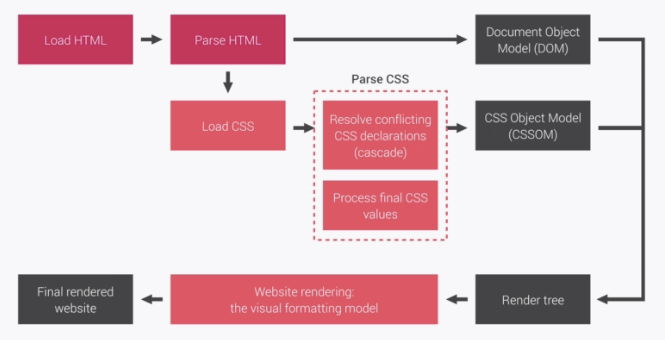

## How css is parsed? The cascade and specificity

### CSS Rule

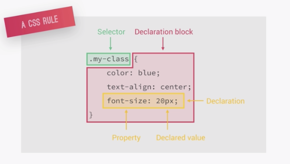

### The cascade (The "C" in CSS)

Process of combining different stylesheets and resolving conflicts between different CSS rules and declarations, when more than one rule applies to a certain element.

Lots of CSS come from, developers, user may change (setting on page for example), browser (user agent)

How to resolve conflict?

**importance (weight) → specificity → source order**

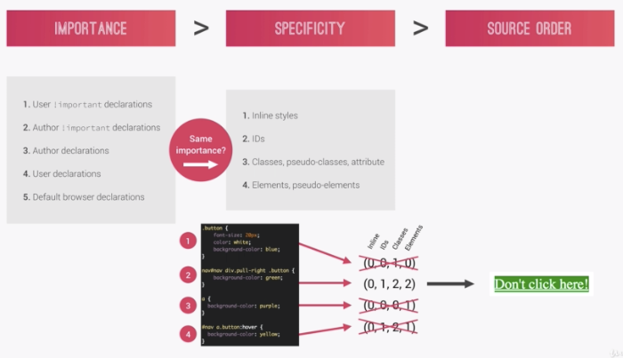

The wining value is called "cascade"~d value. 

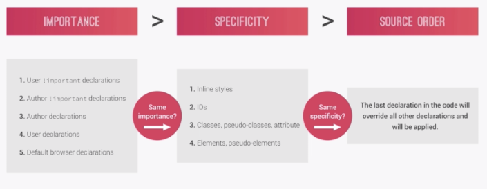

- `!important` is the highest priority
- only use `!important` as the last resource. It's better to use correct specificities - more maintainable code!
- inline styles will always have priority over styles in external stylesheets
- the universal selector `*` has no specificity value (0,0,0,0)
- rely more on **specificity** than on the **order** of selectors
- but rely on order when using 3rd party stylesheets - always put your author stylesheet last

## Value processing

### How to parse from % to actual value

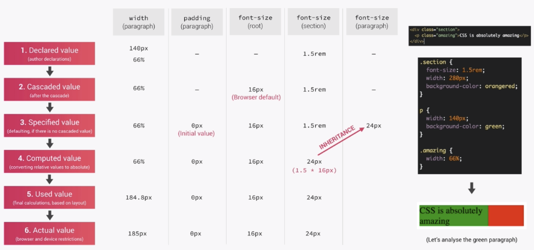

### How to parse from %, em, rem, vh

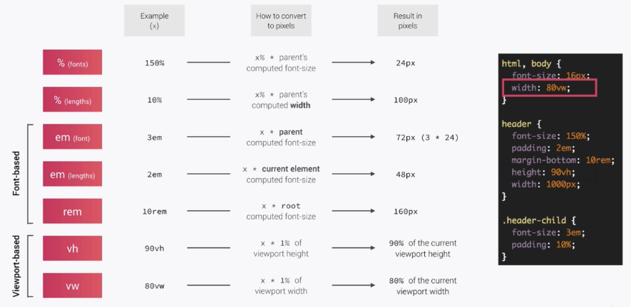

- each property has a initial value, used if nothing is declared (and if there is no inheritance)
- browsers specify a `root` font-size for each page (usually 16px)
- Percentage and relative values are always converted to pixel
- **`%`** are measured relative to their parent's **font-size**, if used to font-size
- **`%`** are measured relative to their parent's **width**, if used to specify length
- `em` are measured relative to their `parent font-size`, if used to specify font-size
- `em` are measured relative to their `current font-size`, if used to specify length
- `rem` ... relative to the `document's root font-size`
- `vh` `vw` ... to the viewport's height and width

## Inheritance

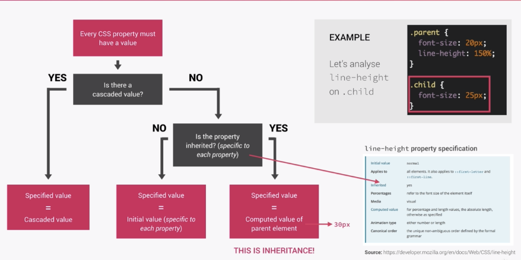

- Passes the values for some specific properties from parent to children
- Properties related to text are inherited: font-family, font-size, color, ...
- The computed value of a property is what gets inherited, **not** the declared value
- Inheritance only works if no one declares a value for that property
- The `inherit` keyword forces inheritance on a certain property
- The `initial` keyword reset a property to its initial value

# Converting px to rem

For easy way to change measurement on page with one simple setting. For example when hitting breakpoint on mobile device. 

Instead of writing hundred of lines of code by using media queries, we can use only one global setting, that is global `font-size`.

# Visual formatting model

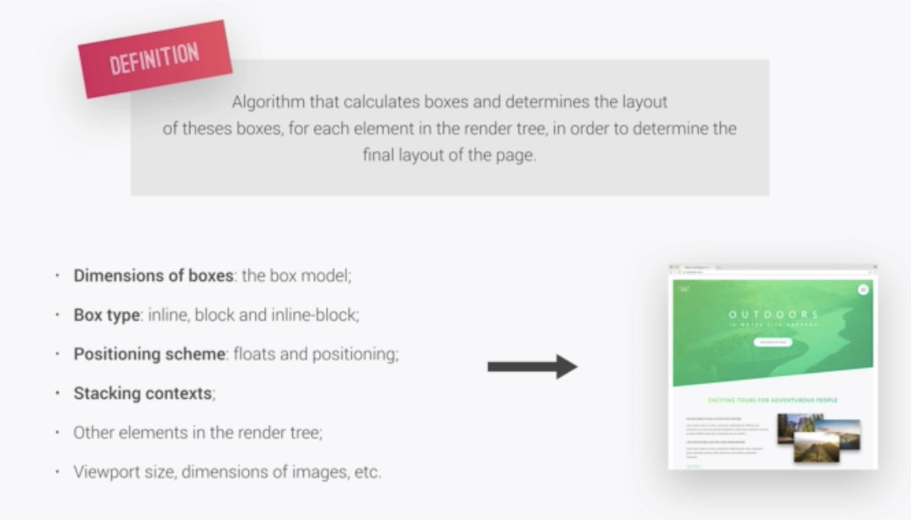

## Box model

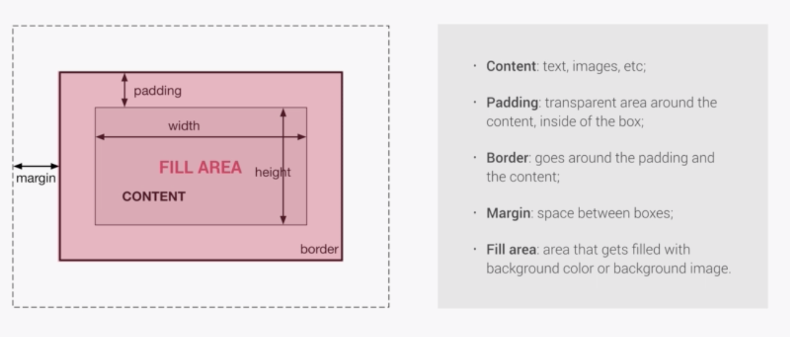

- **total width** = right border + right padding + specified width + left padding + left border
- **total height** = top border + top padding + specified height + bottom padding + bottom border

→ When we specify the height of div, that height is content + padding

→ using `border-box`:

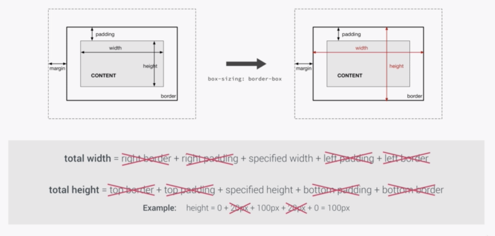

## Box types: inline, block-level, inline-block

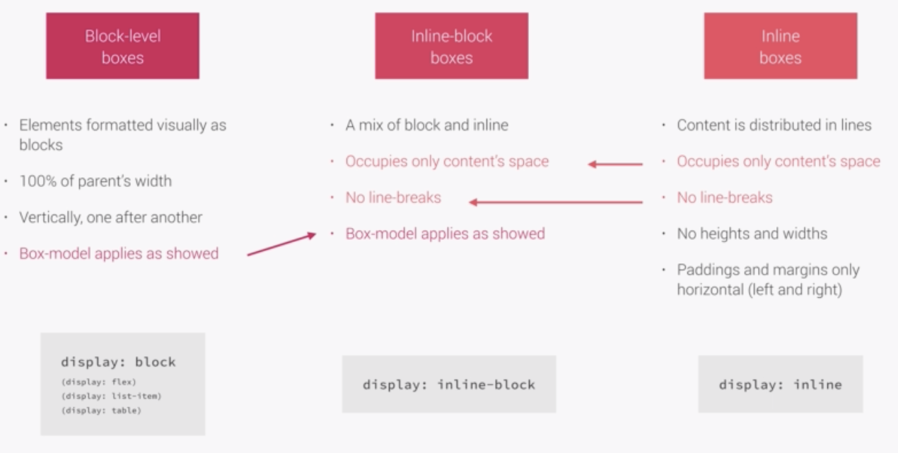

## Positioning schemes: normal, float, absolute

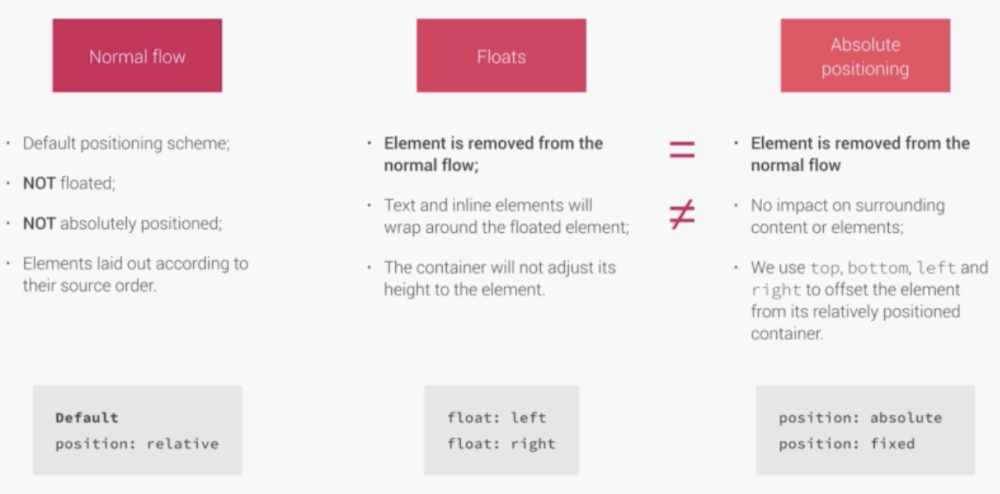

# CSS Architecture, components and BEM

### Think

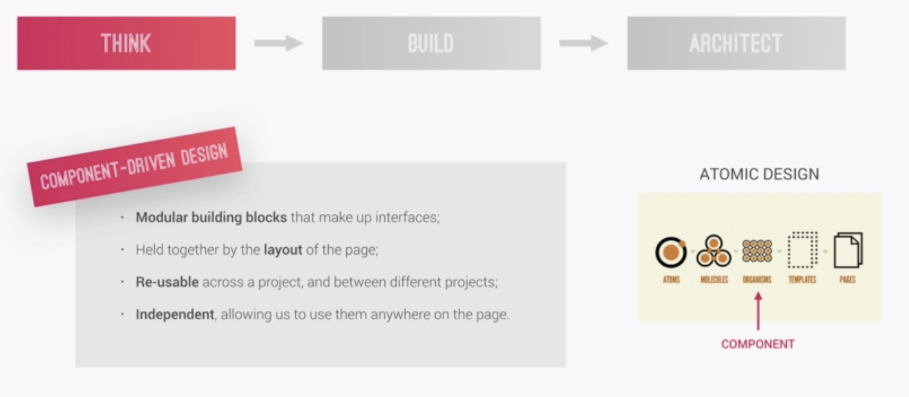

### Build

BEM