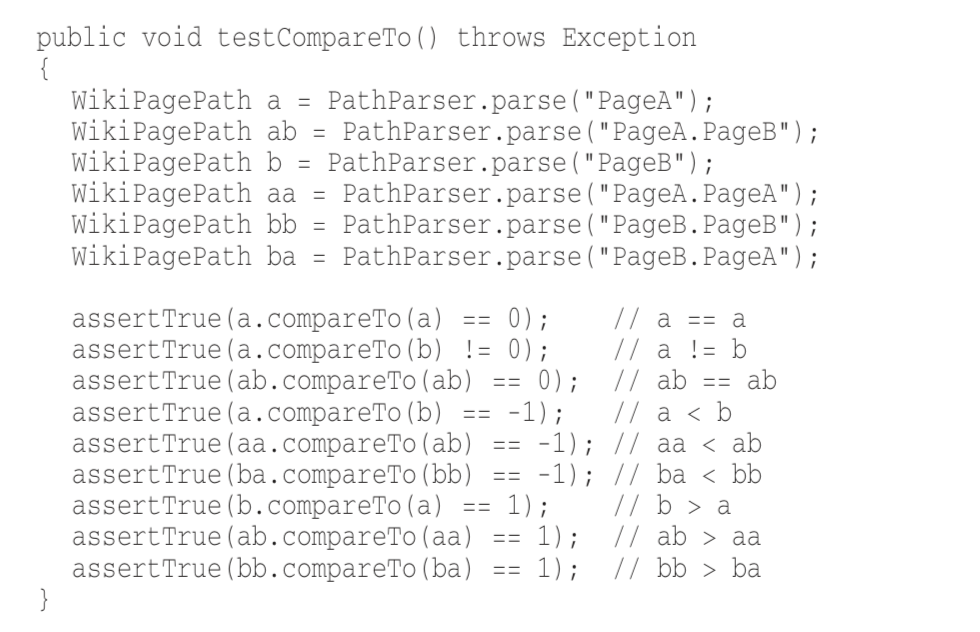
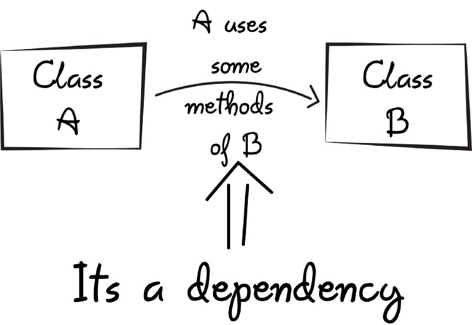
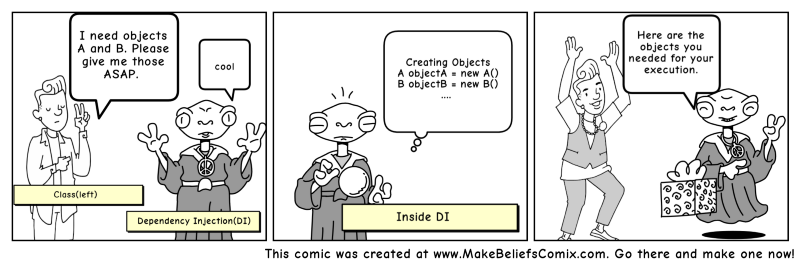

# Clean code

Created: Jun 19, 2019 10:40 AM
Updated: Jul 24, 2019 11:50 AM

# PR Checklists

- [ ]  Can code be shorter, simpler?
- [ ]  Do README need update?
- [ ]  Write comment where necessary
- [ ]  Avoid `unless`
- [ ]  Redundant import js
- [ ]  Redundant import layout
- [ ]  Check on another environment
- [ ]  Check logic route, url, whether route suitable for share, nested or not, can't share URL to user with others
- [ ]  Using params to find user instead of using current_internal_user, potential impersonate
- [ ]  

# Names

## Meaningful Names

### Use intention-revealing names

Choosing good names take times but saves more than it takes. Everyone who reads your code (including you) will be happier if you do.

The name of a var, function, or class, should answer all the big question. It should tell you why it exists, what it does, and how it is used.

> If a name requires a comment, then the name does not reveal its intent

`int d; // elapsed time in days`

Instead: `int elapsedTimeInDays;`

### Avoid disinformation

eg: `theList` `theMessage` `stuff` ..., vague, too long. 

## Make meaningful distinctions

### Use pronounceable names

### Use searchable names

Eg: `MAX_CLASSES_PER_STUDENT`

### Avoid encodings

    for(int j=0;j<32;j++){ ... }

### Member prefixes

Don't need to prefix member variables with `m_` anymore. Your class and function should be small enough that you don't need them.

Besides, people quickly learn to ignore the prefix (or suffix) to jump to the meaningful part of the name. Eventually the prefixes become unseen clutter.

### Interfaces and Implementation

Create a abstract factory for the creation of shapes.

`IShapeFactory` or `ShapeFactory`?

Should leave the interfaces unadorned.
The preceding `I`, is a distraction at best and too much information at worst.

## Class names

Classes and objects should have noun or noun phrase names like `Customer`, `WikiPage`

## Method names

Should have a verb or verb phrase like `postPayment` `save`

## Don't be cute

`whack()` `kill()`

# Functions

## Small!

We used to say that a function should be no bigger than a screen-full. 
However, function should be 2 3 or 4 lines long. Each should be transparently obvious, each told a story

## Do one thing

## One level of abstraction per function

## Function Arguments

Idea number of arguments is 0. 3 should be avoided. 

## No side effect

Avoid making unexpected changes to the variables of its own class

## Don't repeat yourself

# Comments

Comment is a necessary evil. If our programming language were expressive enough, we don't need comment. 

    // Check to see if the employee is eligible for full benefits 
    if ((employee.flags & HOURLY_FLAG) &&
    	(employee.age > 65))

VS

    if (employee.isEligibleForFullBenefits()

## Good comments

### Informative comments

    // Returns an instance of the Responder being tested.
    protected abstract Responder responderInstance();

A comment like this can sometimes be useful, but it is better to use the name of the function to convey the information where possible.

### Clarification

### Warning of consequences

    // Don't run unless you
    // have some time to kill.
    public void _testWithReallyBigFile() {
    	writeLinesToFile(10000000);
    	response.setBody(testFile);
    	response.readyToSend(this);
    	String responseString = output.toString(); assertSubString("Content-Length: 1000000000", responseString); assertTrue(bytesSent > 1000000000);
    }

### Comment out code

There was a time, back in 60s, when commenting out code might have been useful. But we've had good source code control system for a very long time. Those system will remember code for us. Just delete it. Won't lose it. Promise.

# Formatting

Horizontal should not more than 120 chars

## Clean tests

F.I.R.S.T

Fast 

Independent on each other

Repeatable in any env, prod, QA, or even on your laptop while riding home on the train without a network

Self-validating

Timely Test should be written before the prod code that makes them pass. Of course

# Class

Again, should be Small!

The Single Responsibility Principle (SRP) said that a class or module should have one, and only one responsibility. This principle gives us both a definition of responsibility and guidelines for class size.

# Dependency Injection

When class A uses some functionality of class B, then its said that class A has a dependency of class B

In Java, before we can use methods of other classes, we first need to create the object of that class (i.e. class A needs to create an instance of class B).

**So, transferring the task of creating the object to someone else and directly using the dependency is called dependency injection.**

### But why DI?

Let’s say we have a car class which contains various objects such as wheels, engine, etc.

Here the car class is responsible for creating all the dependency objects. Now, what if we decide to ditch **MRFWheels** in the future and want to use **Yokohama** Wheels?

We will need to recreate the car object with a new Yokohama dependency. But when using dependency injection (DI), we can change the Wheels at runtime (because dependencies can be injected at runtime rather than at compile time).

# Simple Design from Kent Beck

- Run all the tests
- Contains no duplication, refactoring
- Expresses the intent of the programmer
- Minimize the number of classes and methods