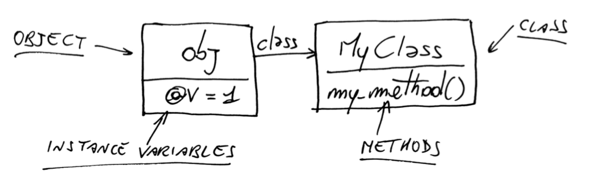
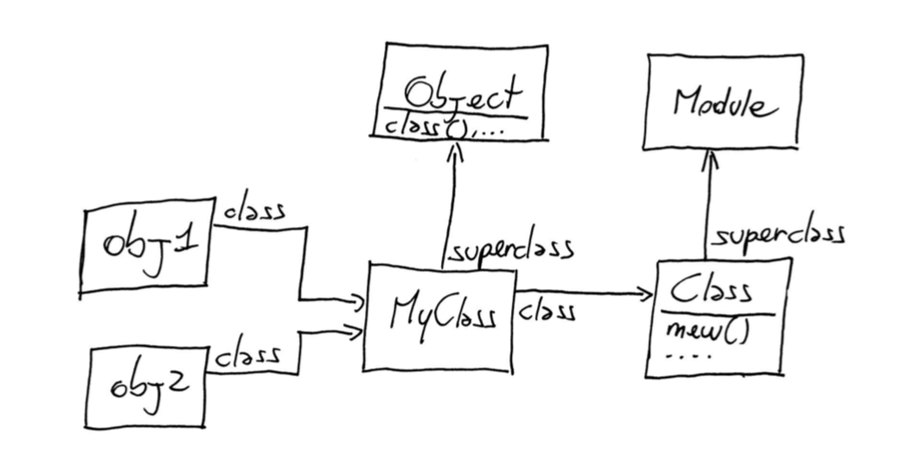
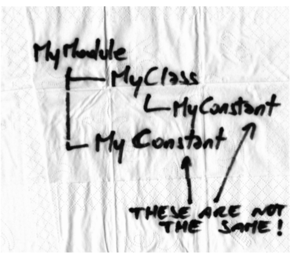
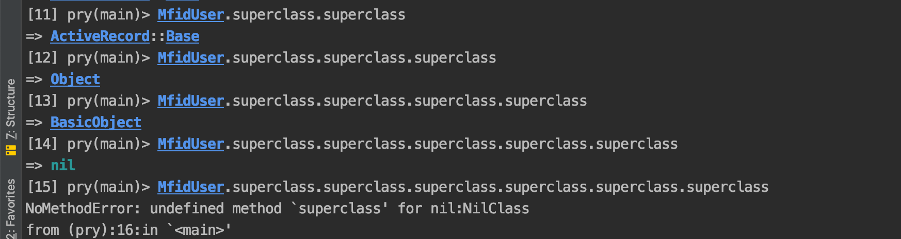
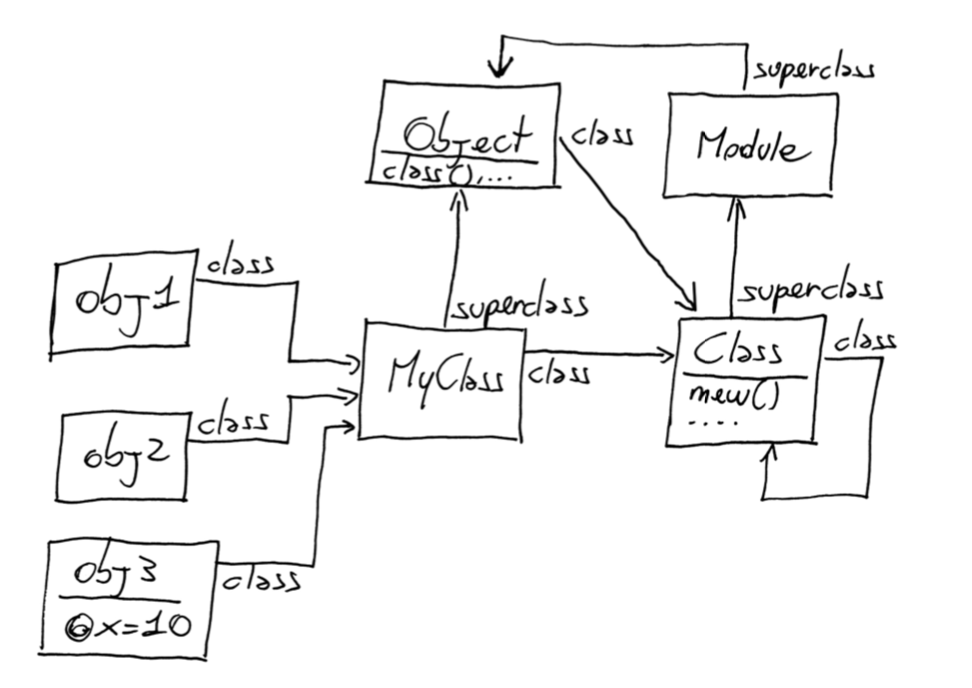
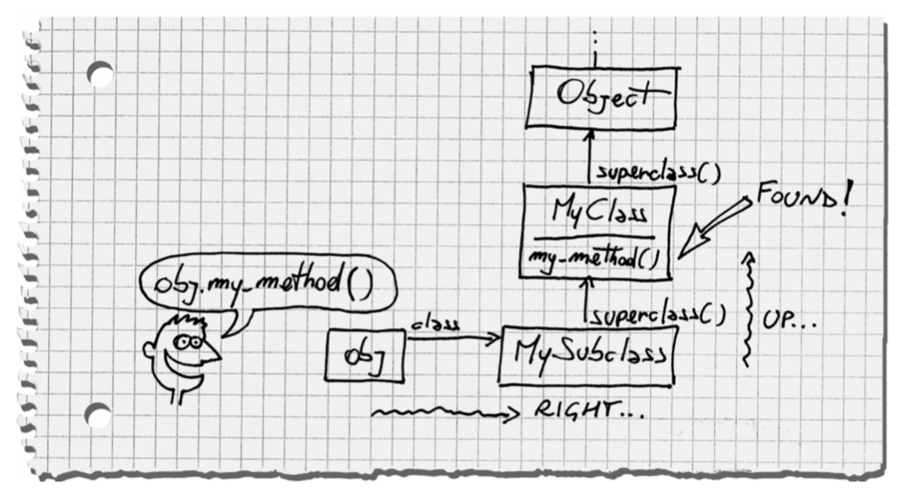
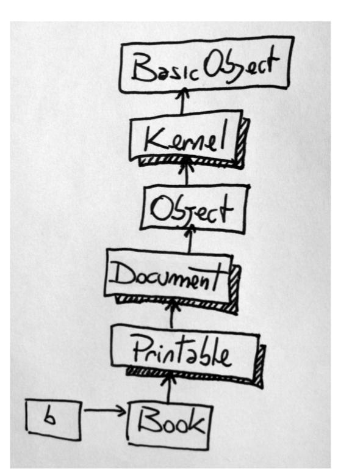

# Ruby Rails

Created: Jun 25, 2019 4:06 PM
Updated: Jul 05, 2019 4:03 PM

# Metaprogramming

## The M Word

### Ghost town and marketplaces

Source code contains variables, classes, methods, ... this is *language constructs.*

In many programming language, after compiler has finished its job, thinks like variables, methods just locations in memory. Can't ask class for its instance methods. In language such as C++, runtime is a quite place, a ghost town.

Meanwhile in Ruby, runtime is more like a busy market place. Most language constructs are still there. 

> You can walk up to language construct and ask it question about itself. This is called introspection.

    class Movie < ActiveRecord::Base
    end
    
    movie = Movie.create
    movie.title = "Doctor Strange"
    movie.title   # => "Doctor Strange"

Movie#title and Movie#title = 

There methods are nowhere to be found in the source code. How can title and title= exist if they're not defined anywhere?

You can find out by looking how ActiveRecord works. First the table name is straight forward. AR looks at the name of the class through introspection and then applies some simple conventions. Class name is Movie, AR maps it to a table named movies. (The library know how to find plurals for English words)

What about methods? AR defines them automatically. AR reads the schema at runtime, discover that movies table has two columns name title and director. So that AR defines methods such as Movie#title and Movie#title= out of thin air while the program runs.

> Metaprogramming is writing code that manipulates language constructs at runtime

Code Generator vs Metap.

Code gen means that you use a program to generate or otherwise manipulate a second, distinct program - and then you run the second program.

## The Object Model

### Class Definition

    class D
    	def x; 'x'; end
    end
    
    class D
    	def y; 'y'; end
    end
    
    
    
    obj = D.new
    obj.x    # => "x"
    obj.y    # => "y"

When the previous code mention `class D` for the first time, no class by that name exists yet. So Ruby defines the class.

At the second mention, `class D` already exist, so Ruby doesn't need to define it. Instead, it reopens the existing class and defines a method name y there.

You can always reopen existing classes and modify them on the fly. You can call this technique *Open Class*.

### The Problem with Open Classes

When you defined your own method, you may be override the original method, the method that some other part also use that method.

This is the dark side to Open Classes. They call those reckless patching of classes is *Monkeypatch*.

### Monkeypatch vs Open Classes

Use with good care, we refer to as Open Classes. lol.

Like any other global modification. Monkeypatches can be difficult to track  in a large code base. To minimize the danger of Monkeypatches, carefully check the existing methods in a class before you defines your own methods. 

Adding a new method is usually safer than modifying an existing one.

We can make it safer by *Refinements*

### Instance Variable

    obj.instance_variables

(?) Unlike Java, in Ruby there is no connection between an object's class and its instance variables.

Object of the same class that carry different instance variables.

### Methods

    obj.methods

Most object inherit a number of methods from Object. We can use Array#grep to check `my_method` is in object's list

`obj.methods.grep(/my/) #=> [:my_method]`

**WTF**: An object contains its instance variables and a reference to a class ... **but no method!**

instance variables live in objects; method live in classes
That's why objects of the same class share methods but don't share instance variables.

We should call:
"obj has a method called `my_method`"
" `my_method` is an *instance method* of MyClass"
not:
"MyClass has a method `my_method`", cause imply that you can call `MyClass.my_method`

## Class

Is an object (an instance of class Class), plus a list of instance methods and a link to a super class.

### Constant

Ruby constant is actually similar to a variable - to the extend you can change the value of a constant, although you will get a warning from interpreter.

The different from a variable is scope. The scope follows its own special rules.

    module MyModule
    	MyConstant = 'Outer constant'
    
    	class MyClass
    		MyConstant = 'Inner constant'
    	end 
    end

    Y = 'a root-level constant'
    
    module M
    	Y = 'a constant in M'
    	Y # => "a constant in M"
    	::Y # => "a root-level constant"
    end

## Loading vs Requiring

`load('display_info.rb')`

The `display_info.rb` file has variables and classes. Those will be removed when the file has finished executing. **However constant don't.** 

Can force to wrap the loading file in an anonymous module.
`load('display_info.rb', true)`
After code executing, Ruby will destroy the module.

`require` has a different purpose. `load` to execute code, `require` to import libraries. That's why requires has no second argument, those leftover class names are probably the reason why you imported the file in the first place.

`require` only load once, while `load` execute the file again every time you call it.

Quiz: MyClass < Object < BasicObject < nil

The same with Module < Object < BasicObject < nil

When you call a method, Ruby does 2 things:

1. Finds the method: *method lookup*
2. Execute the method. Todo that Ruby needs something called *self*

## Method Lookup

When call a method, Ruby looks into the object's class and find the method there.

`receiver`: the object that you call a method on. Eg: `my_string.reverse()` my_string is the receiver

`ancestors chain`: Module < Object < BasicObject
The path of classes when we travel is the ancestors chain of the class.

    class MyClass
    	def my_method; 'my_method()'; end
    end
    
    class MySubclass < MyClass
    end
    
    obj = MySubclass.new
    obj.my_method() # => "my_method()"

### Module lookup

    module M1
    
    def my_method
        'M1#my_method()'
    end end
    
    class C include M1
    end
    
    class D < C; end
    
    D.ancestors # => [D, C, M1, Object, Kernel, BasicObject]

### Method Execution

    def my_method
    temp = @x + 1 my_other_method(temp)
    end

To execute this method, we need to answer:

- what object does @x belong to
- what object should we call `my_other_method` on

Both belongs to the `receiver`, the object that `my_method` was originally called upon. When we call a method, we need to send along a reference to the receiver. Thanks to this, Ruby can remember who is the receiver when it executes the method.

### the `self` keyword

Every line of Ruby code is executed inside an object, the current object. 

    class MyClass
    	def testing_self
    		@var = 10 # An instance variable of self my_method() # Same as self.my_method() self
    	end
    
    	def my_method @var = @var + 1
    	end
    end
    
    obj = MyClass.new
    obj.testing_self # => #<MyClass:0x007f93ab08a728 @var=11>

### What private really means?

    class C
    	def public_method
    		self.private_method
    	end
    	
    	private
    	
    	def private_method; end
    end
    
    C.new.public_method
    ❮ NoMethodError: private method ‘private_method’ called [...]

You can make above code working by removing the `self` keyword.

> You cannot call a private method with an explicit receiver, every time you call a private method, it must be on the implicit receiver - self

Note: explicit means done by the programer (you), has to write. Implicit means done by the compiler or the tool.

- You need an explicit receiver to call a method on an object that is not yourself.
- private method can be called only with an implicit receiver.

(?) Q&A: Let's test above rules!

- Can object x call a private method on object y if the two object share the same class?

    class A end
    
    class X < A
    	def x_private_method; end
    end
    
    class Y < A
    	def y_private_method; end
    end
    
    X.new.y_private_method
    NoMethodError: undefined method `y_private_method' for #<X:0x00007ff8ba298f78>
    Did you mean?  x_private_method
                   private_methods
    

No matter which class you belong to, you still need an explicit receiver to call another object's method.

- Can you call a private method that you inherit from a super class?

    class A end
    
    class X < A
    	def x_private_method; end
    end
    
    class Z < X; end
    
    Z.new.x_private_method #=> OK

You don't need an explicit receiver to call inherited methods on yourself.

### The Top Level

Every time we call a method on an object, that object becomes `self`. 
Who's `self` if you haven't called any method yet?

    self # => main
    self.class # => Object

As soon as you start Ruby, you are sitting within an object named `main` that Ruby interpreter created for you. This object is sometimes call `top-level` context. 

Nothing to do with `main()` functions in C and Java. FYI

### Class Definitions and self

In class or module definition (and outside of any method), the role of `self` is taken by the class or module itself.

    class MyClass
    	self # => MyClass
    end

### Refinements

    class String
    	def to_alphanumeric
    		gsub(/[^\w\s]/, '') 
    	end
    end

The problem with modifying class this way is that the changes are global. This change might become *Monkeypatch* and might break some unrelated code.

From Ruby 2.0, we can deal with this problem using *Refinement*. Begin by writing a module and calling `refine` inside module definition.

    module StringExtensions 
    	refine String do
    		def to_alphanumeric
    			gsub(/[^\w\s]/, '')
    		end 
    	end
    end

This code add new `to_alphanumeric` to method but a Refinement is not active by default.

    "my *1st* refinement!".to_alphanumeric
    ❮ NoMethodError: undefined method `to_alphanumeric' [...]

To activate the changes, you have to do so explicitly, with the `using` method

    using StringExtensions
    
    "my *1st* refinement!".to_alphanumeric # => "my 1st refinement"

Start from Ruby 2.1, we can call `using` inside module definition. The Refinement will be active until the end of module definition.

Refinement are similar to Monkeypatches, but they're not global. 

In the limited scope where it's active, a Refinement is as good as an Open Class or a Monkeypatch.

### (!) Refinement Gotchas

    class MyClass 
    	def my_method
        "original my_method()"
    	end
    
    	def another_method 
    		my_method
    	end 
    end
    
    module MyClassRefinement
    	refine MyClass do
    		def my_method
    			"refined my_method()"
    		end
    	end
    end
    
    using MyClassRefinement
    MyClass.new.my_method      # => "refined my_method()"
    MyClass.new.another_method # => "original my_method()"

The call to `my_method` after the call to `using` we get the refined version of the method, just as we expected.

However, the call to `another_method` is not get refinement.

    another_method → my_method → using → still unrefined version

the call to `another_method` happen before `using`, so it call the original, unrefined version of the method.

### (?) Quiz: Tangle of Modules

    module Printable 
    	def print
    		# ...
    	end
    	
    	def prepare_cover 
    		# ...
    	end 
    end
    
    module Document
    	def print_to_screen
    	    prepare_cover
    	    format_for_screen
    	    print
    	end
    
    	def format_for_screen 
    		# ...
    	end
    
    	def print 
    		# ...
    	end 
    end
    
    class Book
    	include Document
    	include Printable 
    	# ...
    end
    
    b = Book.new
    b.print_to_screen

`print_to_screen` is not calling the right `print` method.

(?) Which version of print get called? Try drawing the chain of ancestors on paper. How can we quickly fix?

- Answer

    

        Book.ancestors 
        # => [Book, Printable, Document, Object, Kernel, BasicObject]

    When call `b.print_to_screen`, b becomes self, and method lookup begins. 

    Ruby find `print_to_screen` method in `Document`, and that methods call other methods - including `print`

    All method call without explicit receiver are called on self, so **method lookup starts once again from Book (self's class) and go up until it finds a method name `print`**

    Quick fix is to swap the include order so that Document gets lower than Printable.

### Wrap up

- When you call a method, Ruby goes `right` into the class of the receiver and then `up` the ancestors chain, until it either finds the method or reaches the end of the chain.
- When `include` a module in a class, the module is inserted in the ancestor chain right **above** the class itself.
- When `prepend` the module, it is inserted in the ancestor chain right **below** the class.

## Methods

### Dynamic Methods

How to call and define methods dynamically. When you call a method, you are actually **sending a message to an object.**

    obj.send(:my_method, 3) #=> 6

(?) Why use `send` instead of the plain old dot notation?

With `send`, the name of the method that you want to call become just a regular argument. We can decide what method to call until the very moment **while** the code is running. This is called **Dynamic Dispatch**.

### Method name and Symbols

Symbols and strings belong to two separate and unrelated classes

    :x.class # => Symbol
    "x".class # => String

(?) Why symbol?

It's convention. Symbols are used as name of things, name of method. Symbols are **immutable,** you can change the characters inside a string, but you can't do that for symbols. 

You wouldn't expect the name of a method to change, so it makes sense to use a symbol when you refer to a method name.

    # rather than: 1.send("+", 2) 
    1.send(:+, 2) # => 3

### Privacy Metter

`Object#send` is very powerful. We an call any method with `send`, including private methods 😕

`public_send`: it's like `send` but can't call private method

### Defining Methods Dynamically

    class Computer
    	def initialize(computer_id, data_source)
        @id = computer_id
        @data_source = data_source
        data_source.methods.grep(/^get_(.*)_info$/) { Computer.define_component $1 }
    	end
    
    	def self.define_component(name) 
    		define_method(name) do
    			info = @data_source.send "get_#{name}_info", @id 
    			price = @data_source.send "get_#{name}_price", @id 
    			result = "#{name.capitalize}: #{info} ($#{price})" 
    			return "* #{result}" if price >= 100
    			result
    		end
    	end
    end

Sprinkling the Code with Introspection

to get rid of all `define_component`:

    define_component :mouse
    define_component :cpu
    define_component :keyboard

You can introspecting the `data_source` argument, to get all the methods:

    data_source.methods.grep(/^get_(.*)_info$/) { 
    	Computer.define_component $1 
    }

`Array#grep{ block }` 

- if we pass a block to grep, the block is evaluated (execute) for each element that matches the regex (regular expression).
- The string that matched the regex is stored in the global variable $1

### method_missing

When method is missing?

    class Lawyer; end 
    nick = Lawyer.new nick.talk_simple
    ❮ NoMethodError: undefined method `talk_simple' for #<Lawyer:0x007f801aa81938>

When you call `talk_simple`, Ruby goes to nick's class and look up for talk_simple in its instance method.

If it can't find it there, it searches up the ancestor chain into Object and eventually BasicObject.

If it can't find anywhere, finally Ruby call `method_missing` on nick, the original receiver. This time Ruby know that `method_missing` is exist, because it's a private instance method of BasicObject that every object inherits.

### Ghost Methods

When we need to define many similar methods, we can response to calls through `method_missing`. This is like saying to the object "If they ask you something and you don't understand, do this"

From the caller's side, a message that's processed by `method_missing` looks like a regular call, but on the receiver's side, it has no corresponding method. This trick is called a *Ghost Method*.

    class Computer
    	def initialize(computer_id, data_source)
          @id = computer_id
          @data_source = data_source
    	end
    	
    	def method_missing(name)
    		super if !@data_source.respond_to?("get_#{name}_info")
    		info = @data_source.send("get_#{name}_info", @id)
    		price = @data_source.send("get_#{name}_price", @id)
    		result = "#{name.capitalize}: #{info} ($#{price})"
    		return "* #{result}" if price >= 100
    		result
    	end
    end
    
    my_computer = Computer.new(42, DS.new)
    my_computer.cpu # => * Cpu: 2.9 Ghz quad-core ($120)

### respond_to_missing?

    cmp = Computer.new(0, DS.new) 
    cmp.respond_to?(:mouse) # => false

`respond_to?` calls a method named `respond_to_missing?` that is supposed to return true if a method is a Ghost Method.
(for easy to understand we could think `respond_to_missing?` to `ghost_method?`)

To prevent `respond_to?` from lying, override `respond_to_missing?` every time you override `method_missing`

    def respond_to_missing?(method, include_private = false) 
    	@data_source.respond_to?("get_#{method}_info") || super
    end

If the method we want to use is exists? We return true, to prove that we can handle the Ghost Methods. If it isn't, it calls `super`. In this case, super is the default `Object#respond_to_missing?` which always return false.

### ⚠️  Method missing trap

    class Roulette
    	def method_missing(name, *args)
    		person = name.to_s.capitalize 3.times do
          number = rand(10) + 1
    			puts "#{number}..." 
    		end
    		"#{person} got a #{number}" 
    	end
    end

When call `number` at the end, the `number` is out of scope and Ruby assumes that `number` must be a method call on `self` 😱 !!!

In normal circumstances, you would get an explicit NoMethodError but in this case you have a `method_missing`. The same chain of events happens again and again ... until the call stack overflows.

This is a common problem with Ghost Methods. You Ghost Methods handle calls which plain wrong.

### ⚠️  Blank Slates

When the name of a Ghost Method clashes with the name of a real, inherited method, the latter wins.

Can fix by removing that inherited class.

> A skinny class with a minimal number of methods is called a Blank Slate.

A way to get Blank Slate is to inherit from BasicObject. BasicObject has a minimal number of methods.

Another way is to remove a specific method from class by using 

- `Module#undef_method` : remove any method, including the inherited ones
- `Module#remove_method` : removes the method from receiver, but it leaves inherited methods alone