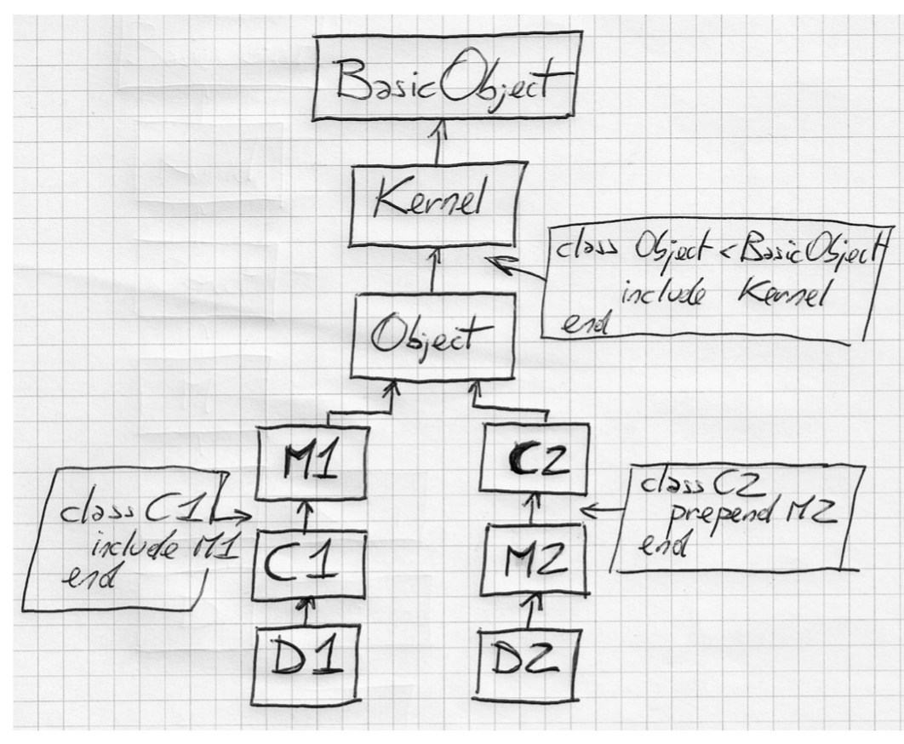
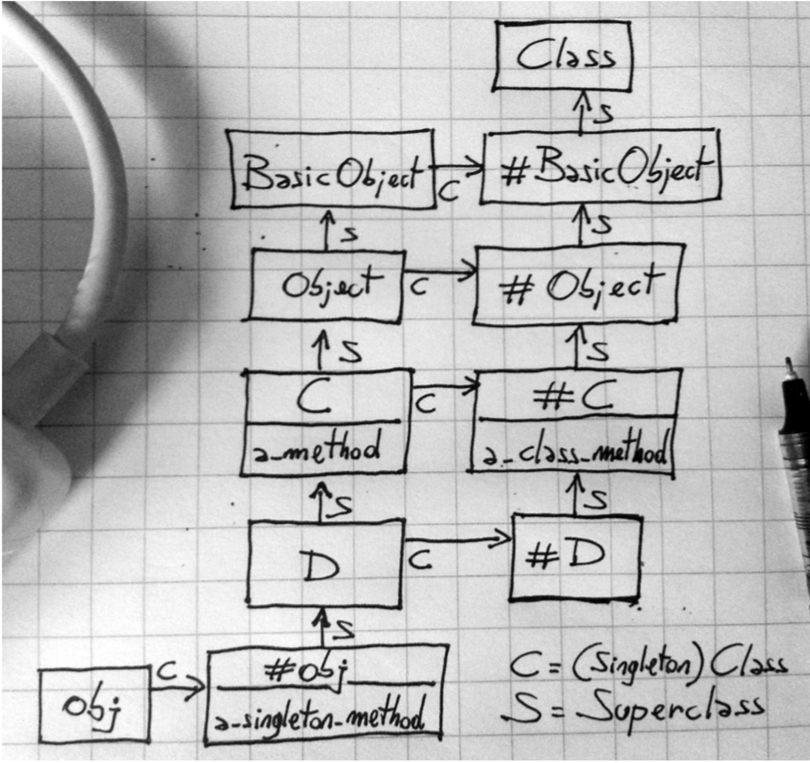

# Ruby Rails

Created: Jun 25, 2019 4:06 PM
Updated: Aug 13, 2019 4:23 PM

# `select map reduce ...`

Imagine we want to get total amount of money company pay for developer role:

    people = [
      {
        first_name: "Gary", 
        job_title: "car enthusiast", 
        salary: "14000" 
      },  
      {
        first_name: "Claire", 
        job_title: "developer", 
        salary: "15000"
      },  
      {
        first_name: "Clem", 
        job_title: "developer", 
        salary: "12000"
      }
    ]
    person1 = people[0][:job_title]
    person2 = people[1][:job_title]
    person3 = people[2][:job_title]
    total = 0
    if person1 == "developer"
        total += people[0][:salary].to_i
    end
    if person2 == "developer"
        total += people[1][:salary].to_i
    end
    if person3 == "developer"
        total += people[2][:salary].to_i
    end
    puts total

That's a lot of code to find for 3 people. Instead we could:

    puts people.select{|x| x[:job_title] == "developer"}.map{|y| y[:salary].to_i}.reduce(:+)

About that `reduce`:

    .reduce(0){|sum, indv| sum + indv} #is the same as .reduce(:+)

Also `reduce` and `inject` are aliases.

## zip

Create new arrays on element index. Imagine align caller array and arguments array in lines. Return new array with element is index of each array.

    a = [ 4, 5, 6 ]
    b = [ 7, 8, 9 ]
    [1, 2, 3].zip(a, b)   #=> [[1, 4, 7], [2, 5, 8], [3, 6, 9]]
    [1, 2].zip(a, b)      #=> [[1, 4, 7], [2, 5, 8]]
    a.zip([1, 2], [8])    #=> [[4, 1, 8], [5, 2, nil], [6, nil, nil]]

### transpose

    a = [[1,2], [3,4], [5,6]]
    a.transpose   #=> [[1, 3, 5], [2, 4, 6]]

Transposes the rows and columns.
Length of subarrays don't match, an IndexError is raised

### partition

    (1..6).partition { |v| v.even? }  
    #=> [[2, 4, 6], [1, 3, 5]]

# Metaprogramming

## The M Word

### Ghost town and marketplaces

Source code contains variables, classes, methods, ... this is *language constructs.*

In many programming language, after compiler has finished its job, thinks like variables, methods just locations in memory. Can't ask class for its instance methods. In language such as C++, runtime is a quite place, a ghost town.

Meanwhile in Ruby, runtime is more like a busy market place. Most language constructs are still there. 

> You can walk up to language construct and ask it question about itself. This is called introspection.

    class Movie < ActiveRecord::Base
    end
    
    movie = Movie.create
    movie.title = "Doctor Strange"
    movie.title   # => "Doctor Strange"

Movie#title and Movie#title = 

There methods are nowhere to be found in the source code. How can title and title= exist if they're not defined anywhere?

You can find out by looking how ActiveRecord works. First the table name is straight forward. AR looks at the name of the class through introspection and then applies some simple conventions. Class name is Movie, AR maps it to a table named movies. (The library know how to find plurals for English words)

What about methods? AR defines them automatically. AR reads the schema at runtime, discover that movies table has two columns name title and director. So that AR defines methods such as Movie#title and Movie#title= out of thin air while the program runs.

> Metaprogramming is writing code that manipulates language constructs at runtime

Code Generator vs Metap.

Code gen means that you use a program to generate or otherwise manipulate a second, distinct program - and then you run the second program.

## The Object Model

### Class Definition

    class D
    	def x; 'x'; end
    end
    
    class D
    	def y; 'y'; end
    end
    
    
    
    obj = D.new
    obj.x    # => "x"
    obj.y    # => "y"

When the previous code mention `class D` for the first time, no class by that name exists yet. So Ruby defines the class.

At the second mention, `class D` already exist, so Ruby doesn't need to define it. Instead, it reopens the existing class and defines a method name y there.

You can always reopen existing classes and modify them on the fly. You can call this technique *Open Class*.

### The Problem with Open Classes

When you defined your own method, you may be override the original method, the method that some other part also use that method.

This is the dark side to Open Classes. They call those reckless patching of classes is *Monkeypatch*.

### Monkeypatch vs Open Classes

Use with good care, we refer to as Open Classes. lol.

Like any other global modification. Monkeypatches can be difficult to track  in a large code base. To minimize the danger of Monkeypatches, carefully check the existing methods in a class before you defines your own methods. 

Adding a new method is usually safer than modifying an existing one.

We can make it safer by *Refinements*

### Instance Variable

    obj.instance_variables

(?) Unlike Java, in Ruby there is no connection between an object's class and its instance variables.

Object of the same class that carry different instance variables.

### Methods

    obj.methods

Most object inherit a number of methods from Object. We can use Array#grep to check `my_method` is in object's list

`obj.methods.grep(/my/) #=> [:my_method]`

**WTF**: An object contains its instance variables and a reference to a class ... **but no method!**

instance variables live in objects; method live in classes
That's why objects of the same class share methods but don't share instance variables.

We should call:
"obj has a method called `my_method`"
" `my_method` is an *instance method* of MyClass"
not:
"MyClass has a method `my_method`", cause imply that you can call `MyClass.my_method`

## Class

Is an object (an instance of class Class), plus a list of instance methods and a link to a super class.

### Constant

Ruby constant is actually similar to a variable - to the extend you can change the value of a constant, although you will get a warning from interpreter.

The different from a variable is scope. The scope follows its own special rules.

    module MyModule
    	MyConstant = 'Outer constant'
    
    	class MyClass
    		MyConstant = 'Inner constant'
    	end 
    end

    Y = 'a root-level constant'
    
    module M
    	Y = 'a constant in M'
    	Y # => "a constant in M"
    	::Y # => "a root-level constant"
    end

## Loading vs Requiring

`load('display_info.rb')`

The `display_info.rb` file has variables and classes. Those will be removed when the file has finished executing. **However constant don't.** 

Can force to wrap the loading file in an anonymous module.
`load('display_info.rb', true)`
After code executing, Ruby will destroy the module.

`require` has a different purpose. `load` to execute code, `require` to import libraries. That's why requires has no second argument, those leftover class names are probably the reason why you imported the file in the first place.

`require` only load once, while `load` execute the file again every time you call it.

Quiz: MyClass < Object < BasicObject < nil

The same with Module < Object < BasicObject < nil

When you call a method, Ruby does 2 things:

1. Finds the method: *method lookup*
2. Execute the method. Todo that Ruby needs something called *self*

## Method Lookup

When call a method, Ruby looks into the object's class and find the method there.

`receiver`: the object that you call a method on. Eg: `my_string.reverse()` my_string is the receiver

`ancestors chain`: Module < Object < BasicObject
The path of classes when we travel is the ancestors chain of the class.

    class MyClass
    	def my_method; 'my_method()'; end
    end
    
    class MySubclass < MyClass
    end
    
    obj = MySubclass.new
    obj.my_method() # => "my_method()"

### Module lookup

    module M1
    	def my_method
        'M1#my_method()'
    	end
    end
    
    class C include M1
    end
    
    class D < C; end
    
    D.ancestors # => [D, C, M1, Object, Kernel, BasicObject]

### Module include vs extend

    module M1
    	def my_method
        'M1#my_method()'
    	end
    end
    
    class C include M1
    end
    
    c = C.new.my_method() #=> 'M1#my_method()'

C → M1 → Object → ...
Method look up can find `#my_method` by travel up to `M1`

### ⚠️ Include vs Extend

    module M1
    	def my_method
        'M1#my_method()'
    	end
    end
    
    class C extend M1
    end
    
    c = C.new.my_method()
    NoMethodError: undefined method `my_method' for #<C:0x00007fa831098c20>
    Did you mean?  method

Using extend will import the module methods as class methods.

Ruby inserts the module in the ancestor chain of the singleton class of the `C` class.

This will work: `C.my_method`. But why?

`class C` is an object from `Class`
`c = C.new` is an object from `class C`
These 2 objects is different

    C.object_id     #=> 70180307387000
    C.new.object_id #=> 70180097246200 
    
    # NoMethodError: undefined method `my_method' for #<C:0x00007fa831098c20>
    # C:0x00007fa831098c20 is C.new

When using `extend`, `my_method()` is only available in `C.object_id     #=> 70180307387000`, the singleton class of the `C` class. That's why: 

    # NoMethodError: undefined method `my_method' for #<C:0x00007fa831098c20>

### Method Execution

    def my_method
    temp = @x + 1 my_other_method(temp)
    end

To execute this method, we need to answer:

- what object does @x belong to
- what object should we call `my_other_method` on

Both belongs to the `receiver`, the object that `my_method` was originally called upon. When we call a method, we need to send along a reference to the receiver. Thanks to this, Ruby can remember who is the receiver when it executes the method.

### the `self` keyword

Every line of Ruby code is executed inside an object, the current object. 

    class MyClass
    	def testing_self
    		@var = 10 # An instance variable of self my_method() # Same as self.my_method() self
    	end
    
    	def my_method @var = @var + 1
    	end
    end
    
    obj = MyClass.new
    obj.testing_self # => #<MyClass:0x007f93ab08a728 @var=11>

### What private really means?

    class C
    	def public_method
    		self.private_method
    	end
    	
    	private
    	
    	def private_method; end
    end
    
    C.new.public_method
    ❮ NoMethodError: private method ‘private_method’ called [...]

You can make above code working by removing the `self` keyword.

> You cannot call a private method with an explicit receiver, every time you call a private method, it must be on the implicit receiver - self

Note: explicit means done by the programer (you), has to write. Implicit means done by the compiler or the tool.

- You need an explicit receiver to call a method on an object that is not yourself.
- private method can be called only with an implicit receiver.

(?) Q&A: Let's test above rules!

- Can object x call a private method on object y if the two object share the same class?

    class A end
    
    class X < A
    	def x_private_method; end
    end
    
    class Y < A
    	def y_private_method; end
    end
    
    X.new.y_private_method
    NoMethodError: undefined method `y_private_method' for #<X:0x00007ff8ba298f78>
    Did you mean?  x_private_method
                   private_methods
    

No matter which class you belong to, you still need an explicit receiver to call another object's method.

- Can you call a private method that you inherit from a super class?

    class A end
    
    class X < A
    	def x_private_method; end
    end
    
    class Z < X; end
    
    Z.new.x_private_method #=> OK

You don't need an explicit receiver to call inherited methods on yourself.

### The Top Level

Every time we call a method on an object, that object becomes `self`. 
Who's `self` if you haven't called any method yet?

    self # => main
    self.class # => Object

As soon as you start Ruby, you are sitting within an object named `main` that Ruby interpreter created for you. This object is sometimes call `top-level` context. 

Nothing to do with `main()` functions in C and Java. FYI

### Class Definitions and self

In class or module definition (and outside of any method), the role of `self` is taken by the class or module itself.

    class MyClass
    	self # => MyClass
    end

### Refinements

    class String
    	def to_alphanumeric
    		gsub(/[^\w\s]/, '') 
    	end
    end

The problem with modifying class this way is that the changes are global. This change might become *Monkeypatch* and might break some unrelated code.

From Ruby 2.0, we can deal with this problem using *Refinement*. Begin by writing a module and calling `refine` inside module definition.

    module StringExtensions 
    	refine String do
    		def to_alphanumeric
    			gsub(/[^\w\s]/, '')
    		end 
    	end
    end

This code add new `to_alphanumeric` to method but a Refinement is not active by default.

    "my *1st* refinement!".to_alphanumeric
    ❮ NoMethodError: undefined method `to_alphanumeric' [...]

To activate the changes, you have to do so explicitly, with the `using` method

    using StringExtensions
    
    "my *1st* refinement!".to_alphanumeric # => "my 1st refinement"

Start from Ruby 2.1, we can call `using` inside module definition. The Refinement will be active until the end of module definition.

Refinement are similar to Monkeypatches, but they're not global. 

In the limited scope where it's active, a Refinement is as good as an Open Class or a Monkeypatch.

### (!) Refinement Gotchas

    class MyClass 
    	def my_method
        "original my_method()"
    	end
    
    	def another_method 
    		my_method
    	end 
    end
    
    module MyClassRefinement
    	refine MyClass do
    		def my_method
    			"refined my_method()"
    		end
    	end
    end
    
    using MyClassRefinement
    MyClass.new.my_method      # => "refined my_method()"
    MyClass.new.another_method # => "original my_method()"

The call to `my_method` after the call to `using` we get the refined version of the method, just as we expected.

However, the call to `another_method` is not get refinement.

    another_method → my_method → using → still unrefined version

the call to `another_method` happen before `using`, so it call the original, unrefined version of the method.

### (?) Quiz: Tangle of Modules

    module Printable 
    	def print
    		# ...
    	end
    	
    	def prepare_cover 
    		# ...
    	end 
    end
    
    module Document
    	def print_to_screen
    	    prepare_cover
    	    format_for_screen
    	    print
    	end
    
    	def format_for_screen 
    		# ...
    	end
    
    	def print 
    		# ...
    	end 
    end
    
    class Book
    	include Document
    	include Printable 
    	# ...
    end
    
    b = Book.new
    b.print_to_screen

`print_to_screen` is not calling the right `print` method.

(?) Which version of print get called? Try drawing the chain of ancestors on paper. How can we quickly fix?

- Answer

    

        Book.ancestors 
        # => [Book, Printable, Document, Object, Kernel, BasicObject]

    When including two modules or more, the last included one will always **be inserted again right between the class and the rest of the chain**

    When call `b.print_to_screen`, b becomes self, and method lookup begins. 

    Ruby find `print_to_screen` method in `Document`, and that methods call other methods - including `print`

    All method call without explicit receiver are called on self, so **method lookup starts once again from Book (self's class) and go up until it finds a method name `print`**

    Quick fix is to swap the include order so that Document gets lower than Printable.

### Wrap up

- When you call a method, Ruby goes `right` into the class of the receiver and then `up` the ancestors chain, until it either finds the method or reaches the end of the chain.
- When `include` a module in a class, the module is inserted in the ancestor chain right **above** the class itself.
- When `prepend` the module, it is inserted in the ancestor chain right **below** the class.

## Methods

### Dynamic Methods

How to call and define methods dynamically. When you call a method, you are actually **sending a message to an object.**

    obj.send(:my_method, 3) #=> 6

(?) Why use `send` instead of the plain old dot notation?

With `send`, the name of the method that you want to call become just a regular argument. We can decide what method to call until the very moment **while** the code is running. This is called **Dynamic Dispatch**.

### Method name and Symbols

Symbols and strings belong to two separate and unrelated classes

    :x.class # => Symbol
    "x".class # => String

(?) Why symbol?

It's convention. Symbols are used as name of things, name of method. Symbols are **immutable,** you can change the characters inside a string, but you can't do that for symbols. 

You wouldn't expect the name of a method to change, so it makes sense to use a symbol when you refer to a method name.

    # rather than: 1.send("+", 2) 
    1.send(:+, 2) # => 3

### Privacy Metter

`Object#send` is very powerful. We an call any method with `send`, including private methods 😕

`public_send`: it's like `send` but can't call private method

### Defining Methods Dynamically

    class Computer
    	def initialize(computer_id, data_source)
        @id = computer_id
        @data_source = data_source
        data_source.methods.grep(/^get_(.*)_info$/) { Computer.define_component $1 }
    	end
    
    	def self.define_component(name) 
    		define_method(name) do
    			info = @data_source.send "get_#{name}_info", @id 
    			price = @data_source.send "get_#{name}_price", @id 
    			result = "#{name.capitalize}: #{info} ($#{price})" 
    			return "* #{result}" if price >= 100
    			result
    		end
    	end
    end

Sprinkling the Code with Introspection

to get rid of all `define_component`:

    define_component :mouse
    define_component :cpu
    define_component :keyboard

You can introspecting the `data_source` argument, to get all the methods:

    data_source.methods.grep(/^get_(.*)_info$/) { 
    	Computer.define_component $1 
    }

`Array#grep{ block }` 

- if we pass a block to grep, the block is evaluated (execute) for each element that matches the regex (regular expression).
- The string that matched the regex is stored in the global variable $1

### method_missing

When method is missing?

    class Lawyer; end 
    nick = Lawyer.new nick.talk_simple
    ❮ NoMethodError: undefined method `talk_simple' for #<Lawyer:0x007f801aa81938>

When you call `talk_simple`, Ruby goes to nick's class and look up for talk_simple in its instance method.

If it can't find it there, it searches up the ancestor chain into Object and eventually BasicObject.

If it can't find anywhere, finally Ruby call `method_missing` on nick, the original receiver. This time Ruby know that `method_missing` is exist, because it's a private instance method of BasicObject that every object inherits.

### Ghost Methods

When we need to define many similar methods, we can response to calls through `method_missing`. This is like saying to the object "If they ask you something and you don't understand, do this"

From the caller's side, a message that's processed by `method_missing` looks like a regular call, but on the receiver's side, it has no corresponding method. This trick is called a *Ghost Method*.

    class Computer
    	def initialize(computer_id, data_source)
          @id = computer_id
          @data_source = data_source
    	end
    	
    	def method_missing(name)
    		super if !@data_source.respond_to?("get_#{name}_info")
    		info = @data_source.send("get_#{name}_info", @id)
    		price = @data_source.send("get_#{name}_price", @id)
    		result = "#{name.capitalize}: #{info} ($#{price})"
    		return "* #{result}" if price >= 100
    		result
    	end
    end
    
    my_computer = Computer.new(42, DS.new)
    my_computer.cpu # => * Cpu: 2.9 Ghz quad-core ($120)

### respond_to_missing?

    cmp = Computer.new(0, DS.new) 
    cmp.respond_to?(:mouse) # => false

`respond_to?` calls a method named `respond_to_missing?` that is supposed to return true if a method is a Ghost Method.
(for easy to understand we could think `respond_to_missing?` to `ghost_method?`)

To prevent `respond_to?` from lying, override `respond_to_missing?` every time you override `method_missing`

    def respond_to_missing?(method, include_private = false) 
    	@data_source.respond_to?("get_#{method}_info") || super
    end

If the method we want to use is exists? We return true, to prove that we can handle the Ghost Methods. If it isn't, it calls `super`. In this case, super is the default `Object#respond_to_missing?` which always return false.

### ⚠️  Method missing trap

    class Roulette
    	def method_missing(name, *args)
    		person = name.to_s.capitalize 3.times do
          number = rand(10) + 1
    			puts "#{number}..." 
    		end
    		"#{person} got a #{number}" 
    	end
    end

When call `number` at the end, the `number` is out of scope and Ruby assumes that `number` must be a method call on `self` 😱 !!!

In normal circumstances, you would get an explicit NoMethodError but in this case you have a `method_missing`. The same chain of events happens again and again ... until the call stack overflows.

This is a common problem with Ghost Methods. You Ghost Methods handle calls which plain wrong.

### ⚠️  Blank Slates

When the name of a Ghost Method clashes with the name of a real, inherited method, the latter wins.

Can fix by removing that inherited class.

> A skinny class with a minimal number of methods is called a Blank Slate.

A way to get Blank Slate is to inherit from BasicObject. BasicObject has a minimal number of methods.

Another way is to remove a specific method from class by using 

- `Module#undef_method` : remove any method, including the inherited ones
- `Module#remove_method` : removes the method from receiver, but it leaves inherited methods alone

## Blocks

Blocks are just one member of a large family of "callable objects", which includes `proc` and `lambdas`

### The basic of Blocks

    def a_method(a, b) 
    	a + yield(a, b)
    end
    
    a_method(1,2){|x,y|(x+y)*3} #=>10

Can define a block with either curly braces or the do..end keywords.

Define a block only when you call a method. The block is passed into the method, and the method can call back to the block with the `yield` keyword.

Block can have arguments. When you `yield` to the block, you can provide value for its argument, just like when you call a method. A block returns the result in the last line of code it evaluates.

Within a method we can ask whether the current call includes a block: `Kernel#block_given?`

### Blocks Are Closures

Code that runs is actually make up of 2 thinks: the code itself and a set of bindings

Bindings here means names that bound to objects.

    def my_method
    	x = "Goodbye" 
    	yield("cruel")
    end
    
    x = "Hello"
    my_method {|y| "#{x}, #{y} world" } # => "Hello, cruel world"

When creating the block, we capture the local bindings, such as x (outer scope)

Then we pass the block to a method that has its own set of bindings. This bindings also include a variable named x.

However the code in the block sees the x that was around when the block was defined, not the method's x

We can define additional bindings inside the block, but they disappear after the block ends

    def just_yield 
    	yield
    end
    
    top_level_variable = 1
    just_yield do 
    	top_level_variable += 1 
    	local_to_block = 1
    end
    
    top_level_variable # => 2 
    local_to_block # => Error!

Because of above behavior, we would say a block is a **closure**. 

> A block captures the local bindings and carries them along with it

### Scope

Ruby does not allow **"inner scope" to see variables from "outer scope"**. That kind of nested visibility doesn't allowed in Ruby. 

    v1 = 1
    
    class MyClass
    	v2 = 2 
    	local_variables 
    
    	def my_method
    		v3 = 3
        local_variables
    	end
      
    	local_variables
    end
    
    obj = MyClass.new
    obj.my_method
    obj.my_method
    local_variables

When program enter MyClass, v1 "fall out of scope" and no longer visible.

### Global Variables vs Top-Level

    def a_scope
    	$var = "some value"
    end
    
    def another_scope 
    	$var
    end
    
    a_scope
    another_scope # => "some value"

Global variables `$var` every part of the system can change them. Very difficult to track which part of your code changing that. So shouldn't use them.

    @var = "The top-level @var"
    
    def my_method 
    	@var
    end
    
    my_method # => "The top-level @var"

We can access a top-level instance var whenever `main` takes the role of `self`. When any other object is `self`, the top level instance variable is out of scope.

### Scope Gates

There are exactly 3 places where a program leaves the previous scope behind (scope change) and opens a new one:

- Class, module, method definitions: `class`
- Module definitions `module`
- Methods `def`

### Flattening the Scope

    my_var = "Success"
    
    class MyClass
    	# We want to print my_var here... 
    	
    	def my_method
    		# ..and here
    	end 
    end

How can we pass a variable through those spots?

Kind of hacky way I think, not really clean. The workaround is to write the keyword `class` to pass the Scope Gate.

    my_var = "Success" 
    
    MyClass = Class.new do
    	"#{my_var} in the class definition"
    
    	define_method :my_method do 
    		"#{my_var} in the method"
    	end
    end
    
    MyClass.new.my_method

**Replace Scope Gates with method calls**, allow one scope to see variables from another scope.

This is called `nested lexical scopes`, or `flattening the scope`, `flat scope`

### Share scope

    def define_methods 
    	shared = 0
    
    	Kernel.send :define_method, :counter do 
    		shared
    	end
    
    	Kernel.send :define_method, :inc do |x| 
    		shared += x
    	end 
    end
    
    define_methods
    counter # => 0 inc(4)
    counter # => 4

Both method an see `shared`, no other method can see `shared` because it's protected by a Scope Gate. This is call Shared Scope.

Not used much in practice.

### JS Closure

    1: function createCounter() {
    2:   let counter = 0
    3:   const myFunction = function() {
    4:     counter = counter + 1
    5:     return counter
    6:   }
    7:   return myFunction
    8: }
    9: const increment = createCounter()
    10: const c1 = increment()
    11: const c2 = increment()
    12: const c3 = increment()
    13: console.log('example increment', c1, c2, c3)

`increment` has a function definition and closure - the variables that are in scope, in this case the `counter = 0`

`increment()` will run the function with variables that are in closure

Notice that `counter` is not in global context, try `console.log(counter)` and you will get `undefined` :)))

`counter` context live inside `increment`'s closure, in it's own scope.

> The closure is a collection of all variables in scope at the time of creation of the function

### `instance_eval()`

    class MyClass 
    	def initialize
    		@v = 1
    	end 
    end
    
    obj = MyClass.new
    obj.instance_eval do
    	self # => #<MyClass:0x3340dc 
    	@v=1 # => @v # => 1
    end

The block inside `instance_eval do ... end` has receiver as `self`, so it can access the receiver's private methods and instances variables.

    v=2
    obj.instance_eval { @v = v } 
    obj.instance_eval { @v } # => 2

The block that passed to `instance_eval` is a *Context Probe*.

### ⚠️ Breaking Encapsulation

With *Context Probe*, doesn't it break all encapsulation? All visibility, no private data anymore. Isn't that A Very Bad Thing?

However in some case it will be useful. Like take a quick peek inside an obj from `irb` command line

### `instance_exec()` vs `instance_eval()`

    class C
    	def initialize
    	  @x = 1
    	end 
    end
    
    class D
    	def twisted_method
    		@y = 2
    		C.new.instance_eval { "@x: #{@x}, @y: #{@y}" } 
    	end
    end
    
    D.new.twisted_method # => "@x: 1, @y: "

You may assume that `D#twisted_method` can access both `@x` instance from C and `@y` from D in the same Flat Scope. 

However, instance variable depend on **self**.

The code inside the block has C is receiver, interprets `@y` as an instance variable of C which hasn't been initialized, as as such is `nil`. 

To merge @x and @y in the same scope, we can use `instance_exec` to pass @y value to the block

    class D
    	def twisted_method
    		@y = 2
    		C.new.instance_exec(@y) {|y| "@x: #{@x}, @y: #{y}" } 
    	end
    end
    
    D.new.twisted_method # => "@x: 1, @y: 2"

### Callable Object

Using a block is a two-step process. First define code inside a block `{ }` and just set a side, leave it there. Second, call the block (by `yield`) to execute the block.

    def my_method(a, b)
    	a + yield(a, b)
    end
    
    my_method(1,2) {|a, b| a*b } #=> 1 + 2 = 3

This kind of "package code first, call it later" mechanism is not just block. There are at least 3 other places in Ruby where you can package code:

- In a *proc*, which is basically a block turned object
- In a *lambda*, which is a slightly variation on a proc
- In a *method*

### Proc Object & Lambda

Although most things in Ruby are objects, blocks are not. With `Proc` you can pack into an object and execute it later.

    inc = Proc.new {|x| x + 1 }
    # more code... inc.call(2) # => 3

This is called `Deferred Evaluation`

`lambda` is just a little bit different:

    dec = lambda {|x| x - 1 } 
    dec.class # => Proc 
    dec.call(2) # => 1

You can create a lambda with the so-called "stabby lambda" operator:

    dec = ->(x) { x + 1 }

### The & Operator

Sometimes using `yield` is not enough. 

- You want to pass the block to another method (or even another block)
- You want to convert the block to a Proc

In both case, you need to point at the block and say: "I want to use this block!"

    def math(a, b) 
    	yield(a, b)
    end
    
    def do_math(a, b, **&operation**) 
    	math(a, b, &operation)
    end
    
    do_math(2,3){|x,y|x*y} #=>6

To convert a block to a Proc:

    def my_method(&the_proc) 
    	the_proc
    end
    
    p = my_method {|name| "Hello, #{name}!" } 
    p.class # => Proc
    p.call("Bill") # => "Hello, Bill!"

## Procs vs. Lambdas

### The way to create

Procs created with lambda are called `lambda` while the others are simply called `procs`.

We can use the `Proc#lambda?` method to check whether the `Proc` is a lambda.

### The way to return

In lambda, return just returns from the lambda

    def double(callable_object)
    	callable_object.call * 2
    end
    
    l = lambda { return 10 }
    double(l) #=> 20

Thinks like return inside block, finish the block only.

In a proc, rather return from the proc, it **returns from the scope where the proc itself was defined**

    def another_double
    	p = Proc.new { return 10 }
    	result = p.call
    	return result * 2 # unreachable code!
    end
    
    another_double # => 10

Thinks like you copy code in Proc and paste in outer scope, then return will be return from the scope where the proc is defined.

⚠️ Bug:

    def double(callable_object) 
    	callable_object.call * 2
    end
    
    p = Proc.new { return 10 }
    double(p) # => LocalJumpError

The program try to return from the scope where p is defined. Because you can't return from the top-level scope, the program fails.

### Argument check

    p = Proc.new {|a, b| [a, b]} 
    p.arity # => 2

What happens if you call this callable object with 3 or 1 argument?

lambda: ArgumentError
block, proc: ok

    p = Proc.new {|a, b| [a, b]}
    p.call(1, 2, 3) # => [1, 2]
    p.call(1) # => [1, nil]

If there are too many arguments, a proc drops the excess arguments. If there are too few arguments, it assigns nil to the missing arguments.

### Method Callable Object

Bound to an object. They are evaluated in that objet's scope. They can also be unbound from their scope and rebound to another object or class.

    class MyClass
    	def initialize(value)
    		@x = value
    	end
    	
    	def my_method
    		@x
    	end
    end
    
    object = MyClass.new(1)
    m = object.method :my_method
    m.call # => 1

(?) A lambda is evaluated in the scope it's defined in (it's a closure). 
A method is evaluated in the scope of its object.

### Unbound Methods

Methods that have been detached from their original class or module. You can turn a Method into an UnboundMethod by calling `Method#unbind` or `Module#instance_method`.

### Writing a Domain-Specific Language DSL

setup.rb

    setup do
      puts "Setting up sky"
    	@sky_height = 100
    end
    
    setup do
    	puts "Setting up mountains" 
    	@mountains_height = 200
    end
    
    event "the sky is falling" do 
    	@sky_height < 300
    end
    
    event "it's getting closer" do 
    	@sky_height < @mountains_height
    end
    
    event "whoops... too late" do 
    	@sky_height < 0
    end

redflag.rb

    def setup(&block) 
    	@setups << block
    end
    
    def event(description, &block)
    	@events << {:description => description, :condition => block}
    end
    
    @setups = [] 
    @events = [] 
    load 'events.rb'
    
    @events.each do |event| 
    	@setups.each do |setup|
    	  setup.call
    	end
    	
    	puts "ALERT: #{event[:description]}" if event[:condition].call 
    end

- initializes `@setup` and `@events`
- load `events.rb`
- The code in the events file calls back into `setup` and `event`, adding (block contents) elements to `@setup` and `@events`
- loop through event, for each event, call setup blocks then call the event

⚠️ Those top-level instance variables, `@events` and `@setups`, are like global variables in disguise. Why don’t you get rid of them?”

We can use *Shared Scope*:

    lambda {
      setups = []
      events = []
    
    	Kernel.send :define_method, :setup do |&block| 
    		setups << block
    	end
    
    	Kernel.send :define_method, :event do |description, &block| 
    		events << {:description => description, :condition => block}
    	end
    
    	Kernel.send :define_method, :each_setup do |&block| 
    		setups.each do |setup|
          block.call setup
    		end 
    	end
    
    	Kernel.send :define_method, :each_event do |&block| 
    		events.each do |event|
          block.call event
    		end
    	end
     }.call
    
    load 'events.rb'
    
    each_event do |event| 
    	each_setup do |setup|
    		setup.call
    	end
    	puts "ALERT: #{event[:description]}" if event[:condition].call 
    end

## Class

### Class Definition

In a class or module definition, the class takes the role of the current object `self`

The current class: we always have a current object: self. The same with class. When we define a method, that method becomes an instance method of the current class.

Although we can get ref to the current object through `self`, there's no equivalent keyword to get a reference to the current class. 

Most of the case we don't need that reference. It's easy to keep track the current class by looking at code.

- At top lever of program, the current class is Object
- In a method, the current class is the class of the current object. 
Try define a method inside another method with def, the new method is defined on which class?
⇒ the class of `self`
- When you open a class with the class keyword, that class becomes the current class.

As you see, there is no need ref to current class. However, on last example, we always need the name of a class. If in some situations you may not know the name of the class that you want to open. For example, a method that takes a class and adds a new instance method to it:

    def add_method_to(a_class)
    	# TODO: define method m() on a_class
    end

(?) How can we open a class if you don't know its name? 

### class_eval()

Module#class_eval or module_eval **evaluates a block in the context of an existing class:**

    def add_method_to(a_class) 
    	a_class.class_eval do
    		def m; 'Hello!'; end 
    	end
    end
    
    add_method_to String
    "abc".m # => "Hello!"

❓ `Module#class_eval` vs `BasicObject#instance_eval`

- `instance_eval` only changes self
- `class_eval` changes both self and the current class

### `class_eval` vs `class`

- By changing the current class, which means class_eval reopen the class and modify, just like the class keyword does
- `class_eval` can receive any variable while class need constant
- `class` open new scope, losing sight of current bindings, while `class_eval` has a Flat Scope, which means you can ref var from outer scope in

The same with instance_eval has instance_exec, class_eval also has class_exec

### `instance_eval` vs `class_eval` ?

- `instance_eval` top open a **object** that is not a class
- `class_eval` top open a class definition and define method with `def`

### Class Instance Variables

🤯 instance variable of class 

instance variables of that class's objects

    class MyClass
    	@my_var = 1                 # class instance variable
    	def self.read; @my_var; end # class instance variable
    	def write; @my_var = 2; end # object instance variable
    	def read; @my_var; end      # object instance variable
    end
    
    obj = MyClass.new
    obj.read      # => nil
    obj.write
    obj.read      # => 2
    MyClass.read  # => 1

Above code defines 2 instance variables. Both named `@my_var` but different in different scopes.

In Java, it's kind of similar to "static fields".

### Class Variables

To store variable in a class, there is another option than just Class Instance Variable.

    class C
    	@@v = 1
    end

Class variables can be accessed by subclasses and by instance methods. This make class variables more similar to Java static fields.

    class D < C
    	def my_method; @@v; end
    end
    
    D.new.my_method # => 1

However class variables don't really belong to classes, they belong to class hierarchies.

Should use class instance variables than class variables. Also Ruby 2.x warn you when access class var from top level.

(?) Write tricky test

    class Loan
    	def initialize(book)
    		@book = book
        @time = Time.now
    	end
    	
    	def to_s
    		"#{@book.upcase} loaned on #{@time}"
    	end
    end

We want to write test for `to_s` method but such code returns a different result every time it runs, we don't know what result to test for.

    class Loan
    	def initialize(book)
    		@book = book
        @time = Loan.time_class.now
    	end
    
    	def 
    		self.time_class @time_class || Time
    	end
    
    	def to_s
    	# ...
    	end
    end

In production, Loan always uses the Time class, because `@time_class` class variable is always null.

However, in unit test:

    class FakeTime
    	def self.now; 'Mon Apr 06 12:15:50'; end
    end
    
    require 'test/unit'
    
    class TestLoan < Test::Unit::TestCase 
    	def test_conversion_to_string
    		Loan.instance_eval { @time_class = FakeTime }
    		loan = Loan.new('War and Peace')
    		assert_equal 'WAR AND PEACE loaned on Mon Apr 06 12:15:50', loan.to_s
    	end 
    end

### Singleton Methods

Ruby allows you to add a method to a single object.

    str = "just a regular string"
    def str.title? 
    	self.upcase == self
    end
    
    str.title? # => false
    str.methods.grep(/title?/) # => [:title?]
    str.singleton_methods # => [:title?]

Above code add a method named `title?` to `str`. No other object gets the method, not even other Strings. 

A method which specific to a single object, is called a Singleton Method. We can define a Singleton Method by using syntax above or the `Object#define_singleton_method`

### Duck Typing

In static language such as Java, you say that an object has type T because it belong to class T.

In a dynamic language such as Ruby, the "type" of an object is not strictly relate to its class. Instead, the "type" is simply the set of methods to which an object can respond.

Duck typing: "if it walks like a duck and quacks like a duck, then it must be a duck." 

**In other words, you don’t care that an object is an instance of class Duck.** 

**You just care that it responds to walk and quack, whether they’re regular methods, Singleton Method, or even Ghost Methods.**

### Class Methods

Class methods are Singleton Method of a class

    def obj.a_singleton_method; end
    def MyClass.another_class_method; end

obj can be object reference, a constant class name, or self.

### Class Macros

`attr_accessor()`

`Module#attr_*` can generate reader and writer for instance variable (attribute), like getter and setter. `attr_reader` generate the reader, `attr_writer` generate writter, and `attr_accessor` generates both.

All the attr_* methods are defined on class Module. A method such as attr_accessor is a Class Macro.

    class Book
    	def title # ...
    	
    	def subtitle # ...
    
    	def lend_to(user)
    		puts "Lending to #{user}" # ...
    	end
    
    	def self.deprecate(old_method, new_method) 
    		define_method(old_method) do |*args, &block|
    			warn "Warning: #{old_method}() is deprecated. Use #{new_method}()."
          send(new_method, *args, &block)
    		end 
    	end
    
      deprecate :GetTitle, :title
      deprecate :LEND_TO_USER, :lend_to
      deprecate :title2, :subtitle
    end

Other project that user the old method name and we have no control on those project. If we rename with the new methods, we will break the callers.

### Singleton Class

    class MyClass
    	def my_method; end
    end
    
    objj = MyClass.new
    obj.my_method

When we call `my_method`, Ruby goes right into MyClass and finds the method there

 Now, what happens if we defines a Single Method on obj?

    def obj.my_singleton_method; end

Where it could live in? Can't be in obj, because obj is not a class. It can't live in MyClass, because if it did, all instances of  MyClass could call it. So where does it live?

When you ask an object for it class `Object#class`, it's not reveal you everything. Not just the class you see, an object can have its own special, hidden class. It can be called *metaclass* or *eigenclass*.

See singleton class by `Object#singleton_class`

    class MyClass
    	def my_method; end
    end
    
    objj = MyClass.new
    obj.my_method
    
    def obj.my_singleton_method; end

Singleton class have only a single instance, and they can't be inherited

MyClass is an instance of Class. MyClass is a singleton class. [`MyClass.new`](http://myclass.new) is an object of MyClass.

A singleton class is where an object's Singleton Methods live.

~~Singleton class has a simple # prefix. #obj is the singleton class of obj.~~

We can open the singleton class of an object with the syntax `class << obj`

### Singleton Classes and Inheritance

    class C
    	class << self
    		def a_class_method 
    			'C.a_class_method()'
    		end 
    	end
    end
    
    class D < C 
    end
    
    obj = D.new
    def obj.a_singleton_method
      # bla bla
    end

### Class Method Syntax

    def MyClass.a_class_method; end
    
    class MyClass
    	def self.another_class_method; end
    end
    
    class MyClass
    	class << self
    		def yet_another_class_method; end
    	end
    end

The second syntax: self is class definition of class.

The third syntax: open singleton class and defines the method in there.

### Class Attributes

    class MyClass 
    	attr_accessor :a
    end
    
    obj = MyClass.new
    obj.a = 2
    obj.a # => 2

`attr_accessor` generate attributes for any **object.**

But what if we want to define an attribute on **class** instead?

    class MyClass; end
    
    class Class
    	attr_accessor :b
    end
    
    MyClass.b = 42
    MyClass.b #=> 42

You might want to reopen class Class and define the attribute there, but it add the attribute to **all class.** To add attribute that's specific to MyClass, you can define the attribute in the singleton class:

    class MyClass
    	class << self
    		attr_accessor :c
    	end
    end
    
    MyClass.c = 'It works!'
    MyClass.c #=> 'It works!'

The superclass of #BasicObject is Class

### Class Extension

How to define a class method by including a module?

    module MyModule
    	def self.my_method; 'hello' end
    end
    
    class MyClass 
    	include MyModule
    end
    
    MyClass.my_method # NoMethodError!

Why? When class includes a module, it gets the module's instance methods - not the class methods. Class methods stay out of reach, in the module's singleton class.

Solution is to define `my_method` as instance method of MyModule. Then include the module in the singleton class of `MyClass`

    module MyModule
    	def my_method; 'hello'; end
    end
    
    class MyClass
    	class << self
    		include MyModule
    	end
    end
    
    MyClass.my_method  # => 'hello'

- `my_method` is an instance method of the singleton class of `MyClass`
- `my_method` is also a class method of MyClass

This is called a Class Extension.

Class methods are just a special case of Singleton Methods.

Singleton methods: 

    str = "this is a string"
    
    def str.is_int?
      # bla bla
    end

Class methods

    class MyClass
    	def my_method; end
    
    	class << self
    		def my_class_method; end
    	end
    
    	def self.yet_another_class_method; end
    end
    
    def MyClass.another_class_method; end

### Object#extend

    module MyModule
    	def my_method; 'hello'; end
    end
    
    obj = Object.new
    obj.extend MyModule
    obj.my_method # => 'hello'
    
    class MyClass
    	extend MyModule
    end
    
    MyClass.my_method # => 'hello'

`Object#extend` is simply a shortcut that includes a module in the receiver's singleton class.

module include: get module instance method

module extend: get module class method

### Method Wrappers

    def deserves_a_look?(book)
    	amazon = Amazon.new 
    	amazon.reviews_of(book).size > 20
    end

What if we want to add additional logic to `reviews_of` method, to catch for exception ...

However we don't/can't modify directly because it's in a library. We want to wrap additional functional around this method. How can we do that?

### Module#alias_method

    class MyClass
    	def my_method; 'my_method()'; end
    	alias_method :m, :my_method
    end
    
    obj = MyClass.new
    obj.my_method # => "my_method()"
    obj.m # => "my_method()"

What happens if you alias a method and then you redefine it?

    class String
    	alias_method :real_length, :length
    
    	def length
    		real_length > 5 ? 'long' : 'short'
    	end
    end
    
    "War and Peace".length  # => "long"
    "War and Peace".real_length #=> 13

We redefines String#length but the alias still refers to the original methods.

⇒ We don't really change the method. We define a new method and attach an existing name to that new method.

### Wrap method using alias

    module Kernel
    	alias_method :require_without_record, :require
    	
    	def require(file)
    		# bla bla
    		require_without_record file
    	end
    end

1. Alias method (after open Kernel class)
2. Redefine it
3. Call old method from the new method :lol:

### Method Wrappers with Refinement

Can be used to wrap method like alias. Can call `super` from a refined method, we will call the original, unrefined method.

    module StringRefinement
    	refine String do
    		def length
    			super > 5 ? 'long' : 'short'
    		end
    	end
    end
    
    using StringRefinement
    
    "War and Peace".length # => "long"

This Refinement Wrapper applies only until the end of the file, so this makes it generally safer than the equivalent Around Alias, which applies everywhere.

### Method Wrappers with module#prepend

`module#prepend` works a bit like `include`, but it inserts the module *below* the include-r in the chain of ancestors, rather than above it. This means:

- a method in a prepended version can override a method in the include-r
- call the non overridden version with `super`

    module ExplicitString 
    	def length
    		super > 5 ? 'long' : 'short' 
    	end
    end
    
    String.class_eval do 
    	prepend ExplicitString
    end
    
    "War and Peace".length # => "long"

### Solving the `#reviews_of` problem

    def deserves_a_look?(book)
    	amazon = Amazon.new 
    	amazon.reviews_of(book).size > 20
    end

We want to wrap logging and exception handling around the `Amazon#reviews_of` method

We can do such by many ways: Around Alias, Refinement Wrapper, Prepended Wrapper

    module AmazonWrapper 
    	def reviews_of(book)
    		start = Time.now
    		result = super
    		time_taken = Time.now - start
    		puts "reviews_of() took more than #{time_taken} seconds" if time_taken > 2 
    		result
    	rescue
    		puts "reviews_of() failed"
    		[]
    	end 
    end
    
    Amazon.class_eval do 
    	prepend AmazonWrapper
    end

### 1 + 1 = 3

    module IntegerWrapper
    	def + numeric
    		tmp = super(super)
    		tmp
    	end
    end
    
    Integer.class_eval do
    	prepend IntegerWrapper
    end

    class Integer
    	alias_method :plus, :+
    
    	def + numeric
    		plus(plus(numeric))
    	end
    end

    module IntegerRefinement
    	refine Integer do
    		def + numeric
    			super(super(nummeric))
    		end
    	end
    end
    
    using IntegerRefinement
    

### Wrap up

- Class Instance Variables: instance variables of that class's objects

    class MyClass
    	@my_var = 1                 # class instance variable
    	def self.read; @my_var; end # class instance variable
    	def write; @my_var = 2; end # object instance variable
    	def read; @my_var; end      # object instance variable
    end
    
    obj = MyClass.new
    obj.read      # => nil
    obj.write
    obj.read      # => 2
    MyClass.read  # => 1

- Class Variables

    class C
    	@@v = 1
    end

- Object Singleton Methods
Ruby allows you to add a method to a single object.

    str = "just a regular string"
    def str.title? 
    	self.upcase == self
    end
    
    str.title? # => false
    str.methods.grep(/title?/) # => [:title?]
    str.singleton_methods # => [:title?]

- Class Methods
Singleton Method of a class

    def obj.a_singleton_method; end
    def MyClass.another_class_method; end

- Singleton Class
Place where Singleton Method live

- Wrap method: alias, Class prepend OverrideModule, refinement

# C6: Code That Writes Code

## `Kernel#eval`

Instead of a block, it takes a string that contains Ruby code - a String of Code, execute it and returns the result

    array = [10, 20]
    element = 30
    eval("array << element") # => [10, 20, 30]

### The REST Client example

`gem install rest-client` is a simple HTTP client library.

    POSSIBLE_VERBS = ['get', 'put', 'post', 'delete']
    
    POSSIBLE_VERBS.each do |m| 
    	eval <<-end_eval
    		def #{m}(path, *args, &b) 
    			r[path].#{m}(*args, &b)
    		end 
    	end_eval
    end

The code uses regular string substitution to generate and `eval` four String of Code, one each for the definition of get, put, post, delete

### Binding Objects

A Binding is a whole scope packaged as an object.

The idea is that you can create a Binding to capture the local scope and carry it around. Later you can execute code in that scope by using the Binding object in conjunction with eval

    class MyClass
    	def my_method
    		@x = 1
    		binding
    	end
    end
    
    b = MyClass.new.my_method
    
    eval "@x", b # => 1

binding is a cleaner forms of closures than blocks because these objects contain a scope but don't contain code

One good example of using binding is Pry: `binding.pry`

Pry defines an `Object#pry` method that open an interactive session inside the object's scope.

irb is just a simple program that parses the standard input or a file and passes each line to eval (Code Processor)

## The trouble with eval()

### Code Injection

Kind of like XSS, inject malicious code into code

    def explore_array(method)
    	code = "['a', 'b', 'c'].#{method}" 
    	puts "Evaluating: #{code}"
    	eval code
    end
    
    explore_array("object_id; Dir.glob('*')")

⇒ Should avoid `eval` when possible

### Tainted Objects and Save Levels

Ruby automatically marks potentially unsafe object, come form external sources..., as tainted

    # read user input
    user_input = "User input: #{gets()}" 
    puts user_input.tainted?
    ➾x=1 
    ❮ true

Ruby has safe levels `$SAFE` global variable, value from 0 → 4

Depend on safe levels being set, you disallow certain potentially dangerous operation

Level 0 is the normal program environment and the security system is not running. Level 2 handles dangerous values. Level 4 handles dangerous code.

    $SAFE = 1
    user_input = "User input: #{gets()}"
    eval user_input
    
    ➾x=1
    ❮ SecurityError: Insecure operation - eval

### The ERB Example

The ERB standard library is the default Ruby template system. This library is a Code Processor that you can use to embed Ruby into any file.

    

    	<strong>Wake up!</strong> 
    	It's a nice sunny 
    	<%= Time.new.strftime("%A") %>.
    

The tag `<%= %>` contains embedded Ruby code. When you pass this template through ERB, the code is evaluated.

Somewhere in ERB's source, there must be a method that takes a snippet of Ruby code extracted from the template and passes it to eval. Sure enough, here it is:

    class ERB
    	def result(b=new_toplevel)
    		if @safe_level proc {
    	    $SAFE = @safe_level
    			eval(@src, b, (@filename || '(erb)'), 0) }.call
    		else
    			eval(@src, b, (@filename || '(erb)'), 0) end
    		end
    	end
    	# ...
    end

If no safe level is set, the content of the tag is simply evaluated.

Otherwise, ERB builds a quick Sandbox, uses a Proc as a Clean Room to execute the code in a separate scope.

    def add_checked_attribute(klass, attribute)
    	eval <<-eval_code
    klass.class_eval do
    	def attribute= input
    		@#{attribute} = input
    	end
    
    	def attribute
    		@#{attribute}
    	end
    end
    	eval_code
    end

    def add_checked_attribute(klash, attribute)
    	eval "
    		class #{klass}
    				def #{attribute}=(value)
    		      raise 'Invalid attribute' unless value
    				@#{attribute} = value 
    			end
    		
    			def #{attribute}() 
    				@#{attribute}
    			end 
    		end
    	"
    end

    def add_checked_attribute(klass, attribute, validate)
    	klass.class_eval do
    		define_method "#{attribute}=" do |value|
    			raise 'Invalid attribute' unless value.call(value) 			
    			instance_variable_set("@#{attribute}", value)
    		end
    
    		define_method attribute do 
    			instance_variable_get "@#{attribute}"
    		end
    	end
    end

    module CheckedAttributes
    	def self.included(klass)
    		klass.extend AttrChecked
    	end
    
    	module AttrChecked
    		def attr_checked(attribute, &validation)
    			define_method "#{attribute}=" do |value|
    				raise 'Invalid attribute' unless validation.call(value) 
    				instance_variable_set("@#{attribute}", value)
    		end
    		
    		define_method attribute do
    			instance_variable_get "@#{attribute}" end
    		end 
    	end
    end
    
    class Person
      include CheckedAttributes
    	
    	attr_checked :age do 
    		|v| v >= 18
    	end 
    end
    
    @bob = Person.new
    @bob.age = 18
    @bob.age # => 18
    @bob.age = nil #=> Exception
    @bob.age = 12 #=> Exception

## Hook Methods

`Class#inherited` `Module#included` `Module#prepended` `Module#extended`

`Module#method_added #method_removed #method_undefined`  

There hooks only work for regular instance methods, which live in the object's class.

They don't work for Singleton Methods, which live in the object's singleton class.

To catch Singleton Method events, you can use `BasicObject#singleton_method_added #singleton_method_removed #singleton_method_undefined`

# The Design of Active Record

AR is the library in Rails that maps Ruby objects to database records. This functionality is called *object-relational mapping*